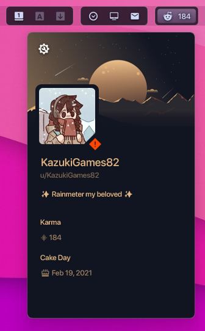

<h1 align="center">
   
  
   
  Karmy - KazukiGames82
   
</h1>

<h4 align="center">Display your reddit karma in the top bar and do showcases with you custom profile card.</h4>

  
  
  
  

  <a href="#key-features">Key Features</a> •
  <a href="#how-to-use">How To Use</a> •
  <a href="#download">Download</a> •
  <a href="#credits">Credits</a> •
  <a href="#license">License</a>

  

## Key Features
- Hideable Text.
- Hideable Icon.

## How to use
1. Open Karmy App Settings.
1. Type your Reddit User into the username field and press enter.
1. Enjoy.

## Download
Download from [releases](https://github.com/KazukiGames82/Karmy-KazukiGames82/releases) or from the [website](https://www.droptopfour.com/community-apps/?id=45)

## Credits
Me.

## License
[GNU General Public License v3.0](LICENSE)

Feel free to modify or redistribute these Rainmeter skins as much as you want. Just:
- Link back to me somehow
- Use ths same license
